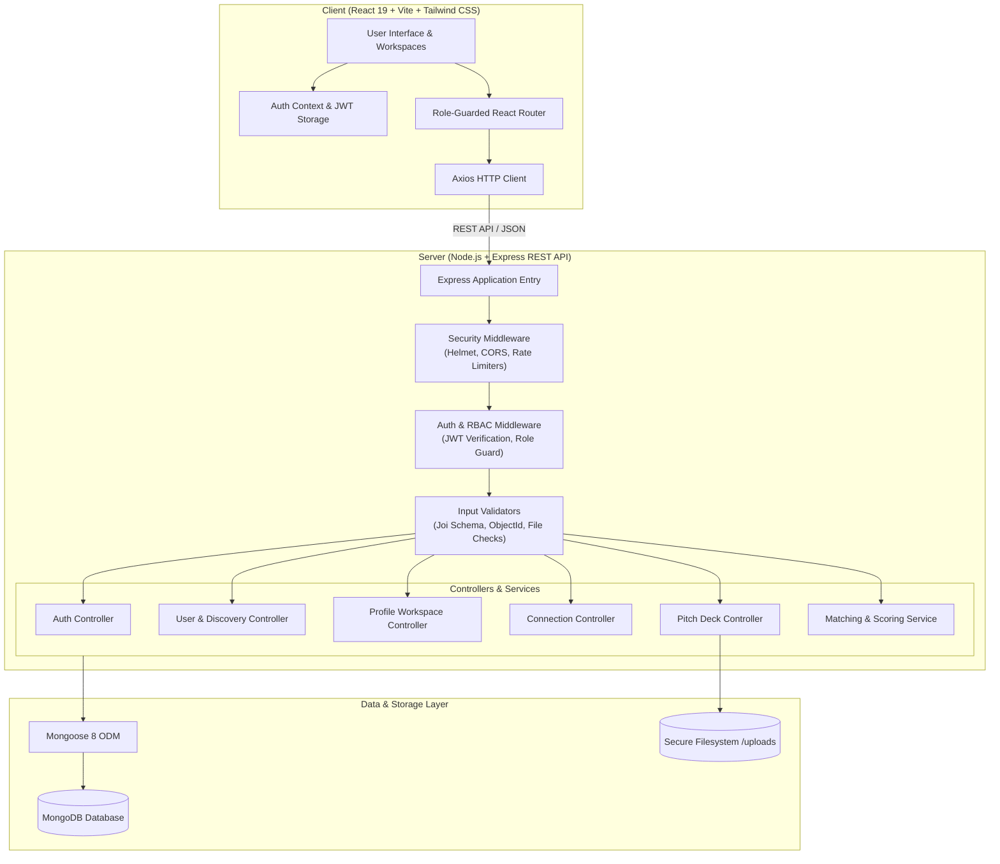
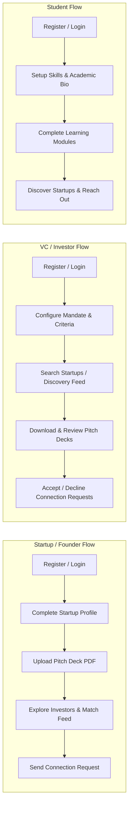
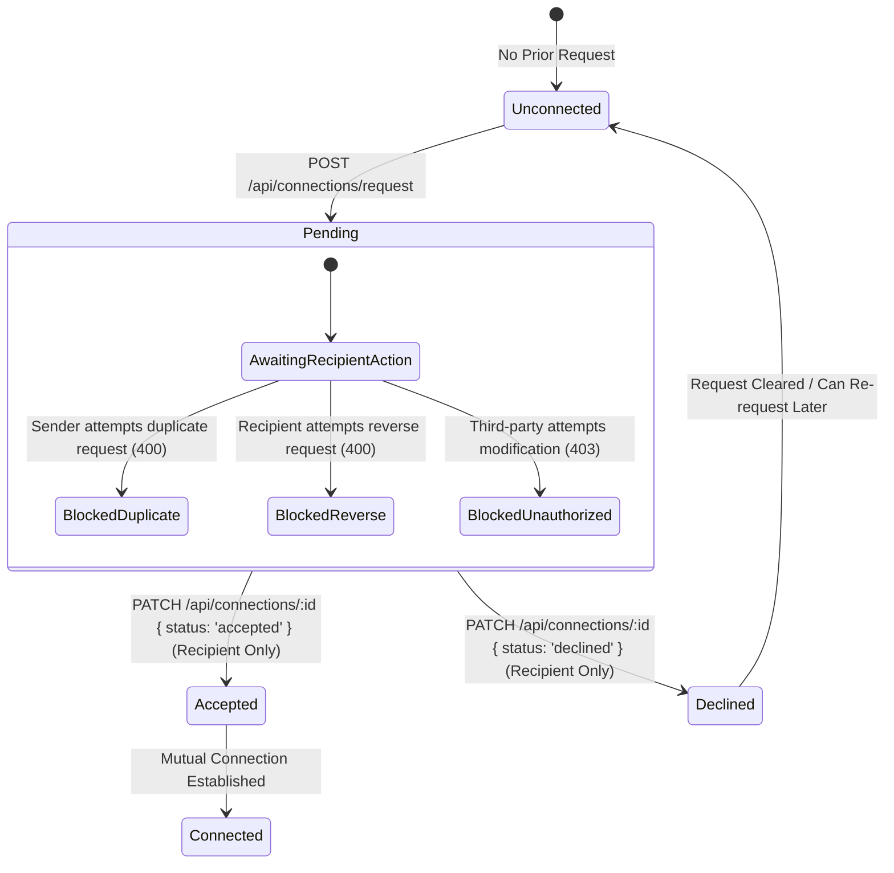

# Linkture

> A role-based startup networking and discovery platform connecting founders, venture capital investors, and students through dedicated workspaces, intelligent discovery, scoring-based matching, and structured connection workflows.

[](https://nodejs.org/)
[](https://react.dev/)
[](https://expressjs.com/)
[](https://www.mongodb.com/)
[](https://nodejs.org/api/test.html)
[](LICENSE)

---

## Table of Contents

1. [Overview](#overview)
2. [Key Features](#key-features)
   - [Startup / Founder Workspace](#startup--founder-workspace)
   - [VC / Investor Workspace](#vc--investor-workspace)
   - [Student Workspace](#student-workspace)
   - [Platform & Core Infrastructure](#platform--core-infrastructure)
3. [Tech Stack](#tech-stack)
4. [Architecture](#architecture)
5. [Role Flow](#role-flow)
6. [Connection Lifecycle & State Machine](#connection-lifecycle--state-machine)
7. [Recommendation & Matching Engine](#recommendation--matching-engine)
8. [Security & Hardening](#security--hardening)
9. [Automated Testing Suite](#automated-testing-suite)
10. [Project Structure](#project-structure)
11. [Local Development Setup](#local-development-setup)
12. [Environment Variables](#environment-variables)
13. [API Reference](#api-reference)
14. [Demo & UI Overview](#demo--ui-overview)
15. [Engineering Highlights](#engineering-highlights)
16. [Known Limitations](#known-limitations)
17. [Future Roadmap](#future-roadmap)
18. [Resume Description](#resume-description)
19. [Interview Talking Points](#interview-talking-points)

---

## Overview

In the modern entrepreneurial ecosystem, founders struggle to identify relevant investors aligned with their specific industry and stage, venture capitalists spend excessive time filtering through unstructured inbound pitches, and students lack structured pathways to engage with emerging startups.

**Linkture** solves these fragmentation challenges by providing a unified, full-stack platform built with role-specific experiences tailored to three key ecosystem participants:

- **Startups / Founders:** Manage venture metadata (stage, funding target, industry, metrics), upload and secure pitch deck documents, discover matched investors, and initiate connection requests.
- **Venture Capitalists / Investors:** Configure investment mandates (domain interests, stages, ticket sizes), explore startups via server-side search, review pitch decks, evaluate rule-scored recommendations, and manage incoming deal flow.
- **Students / Aspiring Entrepreneurs:** Maintain academic and skill profiles, explore startup ecosystems, track interactive learning module progress, and network directly with founders and investors.

---

## Key Features

### Startup / Founder Workspace
- **Persistent Profile & Metrics:** Maintain company name, industry, venture stage, traction metrics, website, and target funding.
- **Secure Pitch Deck Management:** Upload PDF pitch decks with strict MIME validation, file-size enforcement (10MB limit), metadata extraction, and safe deletion.
- **Investor Discovery Engine:** Browse active investors filtered by investment stage and industry domain.
- **Recommendation Feed:** Receive ranked investor and talent recommendations based on shared domains, skills, and complementary role scoring.
- **Connection Hub:** Send, view, and track real-time connection requests to investors and talent.

### VC / Investor Workspace
- **Investment Mandate Configuration:** Define target investment stages (Pre-Seed, Seed, Series A+), domain interests (AI, FinTech, SaaS, Healthcare, etc.), and check sizes.
- **Server-Side Discovery Feed:** Real-time search by company name, founder, location, industry, and stage with paginated results.
- **Pitch Deck Review & Download:** Direct access to download and review uploaded startup pitch decks with path-containment validation.
- **Startup Deal Flow Matches:** View algorithmically scored startup recommendations filtered against active investment mandates.
- **Connection Management Workflow:** Review pending inbound connection requests with one-click **Accept** or **Decline** actions.

### Student Workspace
- **Academic & Skill Profile:** Showcase institution, degree program, expected graduation year, core technical/business skills, and interests.
- **Startup Ecosystem Exploration:** Discover active startups and founders for internship, project, or career opportunities.
- **Interactive Learning Track:** Structured entrepreneurial modules with lesson completion tracking and resource bookmarking persisted to MongoDB.
- **Ecosystem Networking:** Connect directly with startups and venture capitalists.

### Platform & Core Infrastructure
- **Role-Based Access Control (RBAC):** Strict middleware enforcement preventing cross-role privilege escalation.
- **Server-Side Discovery & Pagination:** Sanitized query handling with ReDoS-safe regex escaping and bounded page limits.
- **Deterministic Recommendation Engine:** Weighted scoring model ranking candidates on complementary roles, shared skills, and common domain interests.
- **Bidirectional Connection Engine:** Robust state machine preventing duplicate or inverse-duplicate connection requests.
- **Automated Regression Suite:** 77 comprehensive automated test cases verifying authentication, authorization, IDOR protection, business logic, and security configurations.

---

## Tech Stack

### Frontend
- **Framework:** [React 19](https://react.dev/) (Single Page Application architecture)
- **Build Tool:** [Vite 6](https://vitejs.dev/) (ESM fast bundler)
- **Routing:** [React Router DOM 7](https://reactrouter.com/) (Role-guarded client routing)
- **Styling:** [Tailwind CSS 3](https://tailwindcss.com/) with PostCSS & Autoprefixer
- **HTTP Client:** [Axios](https://axios-http.com/) (JWT interceptors & centralized error handling)
- **Data Visualization:** [Recharts](https://recharts.org/) (Interactive analytics charts)

### Backend
- **Runtime:** [Node.js](https://nodejs.org/) (LTS)
- **Framework:** [Express 4](https://expressjs.com/) (RESTful API architecture)
- **Database:** [MongoDB](https://www.mongodb.com/) via [Mongoose 8 ODM](https://mongoosejs.com/)
- **Authentication:** JSON Web Tokens ([jsonwebtoken](https://github.com/auth0/node-jsonwebtoken)) with [bcryptjs](https://github.com/dcodeIO/bcrypt.js) hashing
- **File Uploads:** [Multer 2](https://github.com/expressjs/multer) (PDF validation and disk storage)
- **Validation:** [Joi 17](https://joi.dev/) (Strict payload schema validation)
- **Security:** [Helmet 8](https://helmetjs.github.io/) (HTTP headers), [express-rate-limit 7](https://github.com/express-rate-limit/express-rate-limit) (API & Auth rate limiting), CORS controls
- **Logging & Utilities:** [Morgan](https://github.com/expressjs/morgan), `dotenv`

### Testing & Quality Assurance
- **Test Runner:** Node.js native test runner (`node:test`, `node:assert/strict`)
- **Database Mocking:** [mongodb-memory-server 11](https://github.com/nodkz/mongodb-memory-server) (In-memory ephemeral MongoDB server for deterministic integration tests)

---

## Architecture



---

## Role Flow



---

## Connection Lifecycle & State Machine

Linkture features a deterministic state machine governing user connections to ensure data integrity and prevent unsolicited spam or race conditions:



### Business Rules & Safeguards
1. **Self-Connection Prevention:** Users cannot initiate connection requests to their own account.
2. **Duplicate Request Protection:** An active `pending` or `accepted` request between two users blocks subsequent connection requests.
3. **Reverse-Duplicate Handling:** If User A has sent a request to User B, User B cannot create a new request back to User A; User B must accept or decline the existing request.
4. **Recipient Ownership Enforcement:** Only the explicitly targeted `recipient` can transition a connection status to `accepted` or `declined`. Third parties or original requesters are rejected with `403 Forbidden`.
5. **Bidirectional Relationship Visibility:** Accepted connections are indexed and visible in both users' network hubs.

---

## Recommendation & Matching Engine

> **Note on Implementation:** Linkture utilizes a transparent, deterministic, rule-and-scoring-based matching algorithm (not machine learning or predictive models).

### Scoring Formulation
The matching service evaluates active candidates from complementary roles and computes a composite relevance score:

$$\text{Total Score} = (\text{Shared Skills} \times 4) + (\text{Shared Interests} \times 2) + \text{Role Bonus}$$

### Algorithm Mechanics:
1. **Role Compatibility Filtering:**
   - `Startup` matches with `VC` and `Student`
   - `VC` matches with `Startup`
   - `Student` matches with `Startup`
2. **Network Exclusion Filter:** Existing `pending` and `accepted` connections (as well as the user themselves) are automatically filtered out of the recommendation pool.
3. **Attribute Normalization & Overlap:** Array attributes (skills, domain interests) are sanitized, deduplicated, and compared using case-insensitive set intersections.
4. **Weighted Role Pairing Bonus:**
   - Startup $\leftrightarrow$ Student pair: $+6$ bonus
   - Startup $\leftrightarrow$ VC pair: $+5$ bonus
5. **Ranking & Truncation:** Candidates with a composite score $> 0$ are ranked in descending order and truncated to the top 10 most relevant recommendations.

---

## Security & Hardening

Linkture implements multi-layered security controls across the entire request-response lifecycle:

| Layer | Security Control | Description |
| :--- | :--- | :--- |
| **Authentication** | `bcryptjs` Password Hashing | Passwords hashed using bcrypt with salt rounds before database storage. Raw passwords never persisted. |
| **Authentication** | JWT Authentication | Stateless authentication using cryptographic JSON Web Tokens passed via standard `Bearer` authorization headers. |
| **Authorization** | Role-Based Access Control | Express middleware (`authorizeRoles`) isolates role-specific endpoints (e.g., VC dashboard strictly restricted to VC role). |
| **Authorization** | IDOR & Ownership Protection | Profile updates, pitch deck modifications, and connection approvals enforce strict user ID ownership checks. |
| **Input Validation** | Joi Schema Validation | Strict request body validation rejecting unknown injected fields and invalid data types with `400 Bad Request`. |
| **Input Validation** | MongoDB ObjectId Validation | Route parameters and query identifiers are strictly validated against MongoDB ObjectId format prior to execution. |
| **Database Security** | ReDoS & Query Sanitization | User search and filter strings pass through regex escaping (`escapeRegex`) to prevent Regular Expression Denial of Service and query injection. |
| **Database Security** | Pagination Bounds | Query pagination (`page`, `limit`) is sanitized with enforced upper boundaries (`limit <= 50`) to prevent denial-of-service memory exhaustion. |
| **File Uploads** | Strict MIME & Extension Check | Multer configuration permits only valid `application/pdf` files with verified `.pdf` extensions. |
| **File Uploads** | File Size Limits | Pitch deck uploads are strictly capped at 10MB per document. |
| **File Storage** | Path Traversal Defense | File download and deletion endpoints utilize `path.resolve` and strict directory containment checks to prevent `../` directory traversal attacks. |
| **Data Privacy** | Sensitive Field Projection | Internal hashes (`passwordHash`), Mongoose internals (`__v`), and private emails are excluded (`select('-passwordHash')`) from discovery, profile, and match responses. |
| **HTTP Security** | Helmet Security Headers | HTTP headers configured via Helmet, including `nosniff` content-type protection and cross-origin resource policies. |
| **Traffic Control** | Rate Limiting | Dual-tier rate limiting: General API limiter (200 req/15min) and strict Authentication limiter (50 req/15min) preventing brute force attempts. |
| **Error Handling** | Production Error Masking | Centralized error handler masks internal 500 server error details and stack traces when running in production environments. |

---

## Automated Testing Suite

Linkture features an extensive automated test suite built with Node.js's native test runner (`node:test`) and `mongodb-memory-server`, providing fast, isolated, deterministic test runs without external database dependencies.

### Verified Test Breakdown (77 Tests Across 12 Suites)

```
✔ Linkture Phase 1 Validation Suite (10 tests)
  - Package manifest and workspace dependency validation
  - Dead code elimination verification
  - User registration & password hash privacy
  - Authentication enforcement and role isolation
  - Profile validation & partial updates
  - Unauthorized cross-user update prevention
  - VC Dashboard real data population & route guards
  - 401 unauthenticated request handling

✔ Linkture Phase 2 Networking & Discovery Suite (20 tests)
  - Connection request lifecycle (send, duplicate, reverse duplicate)
  - Connection recipient authorization & decline workflows
  - Active connection bidirectional visibility
  - Startup & Investor server-side discovery feeds
  - Server-side search, stage, and domain filtering
  - Pagination limit enforcement and metadata validation
  - Sensitive field exclusion in discovery and connections
  - Matching recommendation scoring and exclusion mechanics

✔ Linkture Phase 3 Role Workspaces & Data Persistence Suite (16 tests)
  - Startup workspace persistence (stage, metrics, traction)
  - VC investment mandate persistence & dashboard feed
  - Student profile, lesson completions, and bookmarks persistence
  - PDF pitch deck upload, metadata retrieval, and deletion
  - Cross-user profile update isolation & unauthorized upload blocking
  - Startup discovery synchronization with persisted workspace data

✔ Linkture Phase 4 Security Hardening Suite (33 tests across 8 categories)
  - Authentication Security: Token absence, invalid signatures, malformed headers, hash leakage
  - Role-Based Access Control: Cross-role route and action restriction verification
  - Ownership & IDOR Protection: Profile spoofing, connection hijacking, pitch deck deletion isolation
  - Input Validation: Unknown field rejection, malformed ObjectId handling, pagination sanitization
  - File Upload Security: Non-PDF rejection, oversized file blocking, path traversal prevention
  - Sensitive Data Exposure: Exclusion of credentials and internal fields across all endpoints
  - Security Configuration: Helmet headers, CORS policies, rate-limiting response headers
  - Database & Query Injection: ReDoS meta-character escaping and malicious filter handling

--------------------------------------------------------------------------------
Total Suites: 12  |  Total Tests: 77 Passed (0 Failed, 0 Skipped, 0 Todo)
--------------------------------------------------------------------------------
```

### Running Tests
Execute the entire test suite from the root directory:

```bash
# Run all server test suites
npm test

# Run tests in server workspace directly
npm test --workspace server
```

---

## Project Structure

```
Linkture/
├── .env.example                    # Global environment variable template
├── .gitignore                      # Git ignore rules
├── package.json                    # Monorepo root workspaces & scripts
├── package-lock.json               # Lockfile
├── README.md                       # Repository documentation
├── client/                         # Frontend React application
│   ├── .env.example                # Client environment template
│   ├── index.html                  # HTML entry point
│   ├── package.json                # Client dependencies & scripts
│   ├── postcss.config.js           # PostCSS configuration
│   ├── tailwind.config.js          # Tailwind CSS design system configuration
│   ├── vite.config.js              # Vite bundler configuration
│   └── src/
│       ├── App.jsx                 # Route definitions & layout wrappers
│       ├── main.jsx                # React DOM entry point
│       ├── index.css               # Tailwind & custom CSS styles
│       ├── components/             # Reusable UI components
│       │   ├── AuthShell.jsx       # Authentication layout container
│       │   ├── ConnectionActions.jsx # Connect / Accept / Decline action buttons
│       │   ├── NetworkHub.jsx      # Connection request & active network manager
│       │   ├── ProtectedRoute.jsx  # Role & authentication route guard
│       │   └── RoleCard.jsx        # Landing page role selector card
│       ├── context/
│       │   └── AuthContext.jsx     # Global authentication & user state provider
│       ├── pages/
│       │   ├── LandingPage.jsx     # Platform landing & portal navigation
│       │   ├── auth/               # Role-based login and registration pages
│       │   │   ├── RoleLoginPage.jsx
│       │   │   ├── RoleRegisterPage.jsx
│       │   │   ├── StartupLoginPage.jsx / StartupRegisterPage.jsx
│       │   │   ├── VcLoginPage.jsx / VcRegisterPage.jsx
│       │   │   └── StudentLoginPage.jsx / StudentRegisterPage.jsx
│       │   └── dashboard/          # Role-specific workspaces
│       │       ├── StartupDashboard.jsx # Startup metrics, pitch deck, investor discovery
│       │       ├── VcDashboard.jsx      # VC mandate, deal flow, startup discovery
│       │       └── StudentDashboard.jsx # Student profile, learning modules, ecosystem
│       └── services/
│           └── api.js              # Axios instance with auth interceptors
└── server/                         # Backend Express REST API
    ├── package.json                # Server dependencies & test scripts
    ├── uploads/                    # Local storage for pitch deck PDFs (.gitignore)
    ├── src/
    │   ├── app.js                  # Express app, middleware, routes, error handler
    │   ├── server.js               # HTTP server listener & DB connection entry
    │   ├── controllers/            # Request handlers
    │   │   ├── authController.js   # Register, Login, Me endpoints
    │   │   ├── connectionController.js # Connection workflow handlers
    │   │   ├── matchController.js  # Match recommendation handler
    │   │   ├── pitchDeckController.js # Pitch deck upload, download, delete
    │   │   ├── profileController.js   # User profile workspace handlers
    │   │   └── userController.js      # Startup & Investor discovery endpoints
    │   ├── middleware/             # Express middlewares
    │   │   ├── authMiddleware.js   # JWT authentication verification
    │   │   ├── profileValidator.js # Joi input validation schemas
    │   │   └── roleMiddleware.js   # Role-based authorization guard
    │   ├── models/                 # Mongoose schemas
    │   │   ├── Connection.js       # Connection state machine schema
    │   │   └── User.js             # User & role subdocument schemas
    │   ├── routes/                 # Express API route declarations
    │   │   ├── authRoutes.js
    │   │   ├── connectionRoutes.js
    │   │   ├── matchRoutes.js
    │   │   ├── pitchDeckRoutes.js
    │   │   ├── profileRoutes.js
    │   │   └── userRoutes.js
    │   ├── services/               # Business logic services
    │   │   ├── jwtService.js       # JWT signing & verification utilities
    │   │   └── matchingService.js  # Recommendation & scoring engine
    │   └── utils/
    │       ├── ApiError.js         # Custom structured error class
    │       └── asyncHandler.js     # Async route wrapper for error forwarding
    └── test/                       # Automated test suites
        ├── phase1.test.js          # Core validation & authentication suite
        ├── phase2.test.js          # Networking & discovery engine suite
        ├── phase3.test.js          # Role workspaces & persistence suite
        └── phase4.test.js          # Security hardening & regression suite
```

---

## Local Development Setup

### Prerequisites
- [Node.js](https://nodejs.org/) (v18.0.0 or higher recommended)
- [npm](https://www.npmjs.com/) (v9.0.0 or higher)
- [MongoDB](https://www.mongodb.com/try/download/community) (Local MongoDB instance running on port 27017, or MongoDB Atlas connection string)

### 1. Clone the Repository
```bash
git clone https://github.com/nivyashreeug/Linkture.git
cd Linkture
```

### 2. Install Dependencies
Install all root, server, and client dependencies using npm workspaces:
```bash
npm install
```

### 3. Configure Environment Variables
Create the server `.env` file from the example template:
```bash
# On Linux/macOS
cp .env.example .env

# On Windows PowerShell
copy .env.example .env
```

*(Optional)* Configure client environment if overriding the default API URL:
```bash
# On Linux/macOS
cp client/.env.example client/.env

# On Windows PowerShell
copy client/.env.example client/.env
```

### 4. Start the Application
Run both backend API and frontend Vite dev server concurrently:
```bash
npm run dev
```

Alternatively, run each service independently in separate terminals:
```bash
# Terminal 1: Backend Server (http://localhost:5000)
npm run dev:server

# Terminal 2: Frontend Client (http://localhost:5173)
npm run dev:client
```

### 5. Run Automated Tests
Execute the comprehensive test suites:
```bash
npm test
```

### 6. Build Client for Production
```bash
npm run build
```

---

## Environment Variables

### Backend Configuration (`.env`)
| Variable | Description | Default / Example |
| :--- | :--- | :--- |
| `MONGODB_URI` | MongoDB connection URI | `mongodb://127.0.0.1:27017/linkture` |
| `JWT_SECRET` | Secret key for signing and verifying JWT tokens | `your_long_random_jwt_secret_key` |
| `JWT_EXPIRES_IN` | Token validity duration | `7d` |
| `PORT` | Backend HTTP server port | `5000` |
| `CLIENT_URL` | Allowed frontend origin for CORS policies | `http://localhost:5173` |

### Frontend Configuration (`client/.env`)
| Variable | Description | Default / Example |
| :--- | :--- | :--- |
| `VITE_API_URL` | Base REST API URL accessed by Axios | `http://localhost:5000/api` |

---

## API Reference

### Authentication (`/api/auth`)
| Method | Endpoint | Description | Auth Required |
| :--- | :--- | :--- | :--- |
| `POST` | `/api/auth/register` | Register a new user with role-specific profile fields | No |
| `POST` | `/api/auth/login` | Authenticate user and receive JWT bearer token | No |
| `GET` | `/api/auth/me` | Retrieve authenticated user's profile and session data | Yes (`Bearer Token`) |

### User Profile & Workspaces (`/api/profile`)
| Method | Endpoint | Description | Auth Required |
| :--- | :--- | :--- | :--- |
| `GET` | `/api/profile` | Retrieve the authenticated user's full workspace profile | Yes |
| `GET` | `/api/profile/:id` | Retrieve another user's sanitized public profile | Yes |
| `PUT` / `PATCH` | `/api/profile` | Update authenticated user's profile with Joi validation | Yes |

### Discovery & Users (`/api/users`)
| Method | Endpoint | Description | Auth Required |
| :--- | :--- | :--- | :--- |
| `GET` | `/api/users/profile` | Legacy profile retrieval endpoint | Yes |
| `GET` | `/api/users/vc/dashboard`| Aggregate startup metrics and deal feed (VC-only) | Yes (`VC Role`) |
| `GET` | `/api/users/startups` | Search and filter startups with pagination | Yes |
| `GET` | `/api/users/investors` | Search and filter investors with pagination | Yes |

### Connections (`/api/connections`)
| Method | Endpoint | Description | Auth Required |
| :--- | :--- | :--- | :--- |
| `POST` | `/api/connections/request` | Send a new connection request to another user | Yes |
| `GET` | `/api/connections` | Retrieve incoming, outgoing, and active connections | Yes |
| `PATCH` | `/api/connections/:id` | Accept or decline an inbound connection request | Yes (`Recipient Only`) |
| `GET` | `/api/connections/status/:targetUserId` | Get connection relationship state with target user | Yes |

### Recommendations & Matches (`/api/match`)
| Method | Endpoint | Description | Auth Required |
| :--- | :--- | :--- | :--- |
| `GET` | `/api/match` | Get ranked, scored partner recommendations | Yes |

### Pitch Deck Management (`/api/startups/pitch`)
| Method | Endpoint | Description | Auth Required |
| :--- | :--- | :--- | :--- |
| `POST` | `/api/startups/pitch` | Upload a PDF pitch deck document (max 10MB) | Yes (`Startup Role`) |
| `GET` | `/api/startups/pitch` | Get pitch deck metadata for authenticated user or query ID | Yes |
| `DELETE` | `/api/startups/pitch` | Delete authenticated startup's uploaded pitch deck | Yes (`Startup Role`) |
| `GET` | `/api/startups/pitch/download/:fileName` | Securely download a validated pitch deck PDF | Yes |

---

## Demo & UI Overview

Linkture features dedicated, modern responsive workspaces tailored to each user type:

- **Landing Experience (`/`):** Unified introduction showcasing platform capabilities with role-based portal routing.
- **Startup Workspace (`/dashboard/startup`):** Comprehensive interface for managing venture traction, updating pitch deck assets, discovering investors, and evaluating prospective talent.
- **VC Workspace (`/dashboard/vc`):** Analytical dashboard providing deal flow filtering, startup discovery feeds, pitch deck evaluation, and connection request approvals.
- **Student Workspace (`/dashboard/student`):** Interactive learning environment with modular entrepreneurial curriculum tracking and startup directory discovery.

*Note: Visual UI previews and screenshots can be generated directly by launching the local development environment (`npm run dev`).*

---

## Engineering Highlights

1. **Strict Role-Based Routing & Authorization:** Designed modular middleware (`authMiddleware`, `roleMiddleware`, `profileValidator`) that enforces principle of least privilege across all API endpoints and frontend route guards.
2. **Deterministic State Machine:** Built a robust connection workflow with bidirectional duplicate prevention, reverse-duplicate checks, and recipient-only state transition enforcement.
3. **Multi-Tier Security Hardening:** Implemented comprehensive protection against common web vulnerabilities, including ReDoS escaping on database queries, strict path traversal containment checks on file downloads, Joi payload schema validation, Helmet security headers, and dual-tier rate limiting.
4. **Transparent Weighted Recommendation Engine:** Formulated a deterministic scoring model evaluating complementary role pairing, normalized skill overlap, and domain interest alignment without opaque dependencies.
5. **High-Velocity Automated Testing:** Established 77 automated integration and unit tests using `mongodb-memory-server` and Node.js native test runner, ensuring regression-free deployments and zero external test database overhead.

---

## Known Limitations

- **Local Filesystem Document Storage:** Pitch deck PDF files are stored on the server's local filesystem (`server/uploads/`). For a horizontally scaled production deployment across multiple server instances, file storage would be migrated to a dedicated cloud object storage service such as Amazon S3 or Google Cloud Storage with signed URLs.

---

## Future Roadmap

- [ ] Cloud object storage integration (Amazon S3 / Google Cloud Storage) for scalable document management.
- [ ] Real-time WebSocket or Server-Sent Events (SSE) for instant connection request notifications.
- [ ] Email notifications for inbound connection requests and acceptance alerts.
- [ ] Direct in-platform messaging between confirmed active connections.
- [ ] Extended analytics dashboard tracking startup profile views and pitch deck engagement.

---

## Resume Description

- **Full-Stack Startup Networking Platform (MERN):** Architected and developed a full-stack platform connecting startups, venture capitalists, and students, featuring dedicated role-based workspaces, interactive analytics, and structured connection workflows.
- **Security Hardening & IDOR Protection:** Implemented robust RBAC, JWT authentication with bcrypt hashing, Joi schema validation, ReDoS query protection, Helmet HTTP headers, rate limiting, and path-traversal-safe file upload handling.
- **Scoring Engine & Automated Testing:** Engineered a deterministic, weighted recommendation scoring engine and authored 77 comprehensive automated test cases with `mongodb-memory-server` across 12 test suites ensuring 100% test pass rate.

---

## Interview Talking Points

1. **Why Linkture was Built:** Designed to solve ecosystem fragmentation by connecting founders seeking capital, VCs sourcing specific investment criteria, and students seeking startup opportunities within a unified, role-segregated platform.
2. **Architecture Overview:** Monorepo architecture pairing a React 19 / Vite single-page application with an Express 4 REST API and MongoDB/Mongoose data persistence.
3. **Database Design (MongoDB & Mongoose):** Selected MongoDB for schema flexibility, allowing role-specific subdocuments (`startupProfile`, `vcProfile`, `studentProfile`) to co-exist cleanly inside a unified `User` model alongside a dedicated `Connection` state model.
4. **JWT Authentication & Security:** Stateless authentication via signed JSON Web Tokens passed in Authorization headers, with passwords securely hashed using bcrypt. Sensitive fields (`passwordHash`, `__v`, `email`) are strictly stripped from all public API projections.
5. **Role-Based Access Control (RBAC):** Implemented modular Express middleware (`authorizeRoles`) and React Router protected route wrappers to prevent unauthorized access to role-gated dashboards and actions.
6. **Connection State Machine:** Designed a transactional connection workflow transitioning from `pending` to `accepted` or `declined`, with automated guards against duplicate requests, reverse duplicates, self-connections, and third-party tampering.
7. **Server-Side Discovery & ReDoS Protection:** Discovery endpoints implement server-side search, filtering, and bounded pagination (`limit <= 50`). All user search queries are escaped (`escapeRegex`) before constructing MongoDB regex queries to prevent ReDoS attacks.
8. **Matching & Scoring Engine:** Formulated a transparent scoring algorithm evaluating complementary role pairings (+5/+6), shared skills (+4/skill), and domain interests (+2/interest), excluding existing connections.
9. **Pitch Deck Upload Security:** Enforced multipart upload controls restricting files strictly to `application/pdf` under 10MB. Download and deletion endpoints enforce path containment checks using `path.resolve` to prevent directory traversal exploits.
10. **Automated Testing Strategy:** Implemented 77 unit and integration tests using Node.js's native `node:test` runner and `mongodb-memory-server`, providing rapid, isolated in-memory test execution without polluting persistent databases.
11. **Production Scaling Strategy:** For horizontal scaling, document storage would transition from local disk to S3/GCS object storage, connection state updates would broadcast via Redis Pub/Sub / WebSockets, and caching layers (Redis) would front high-frequency discovery queries.
